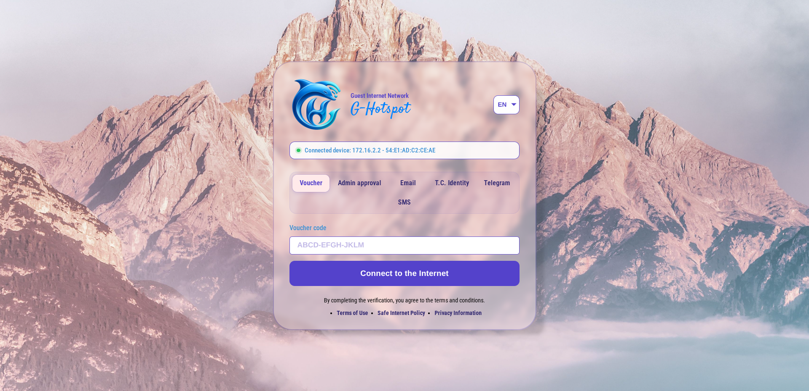
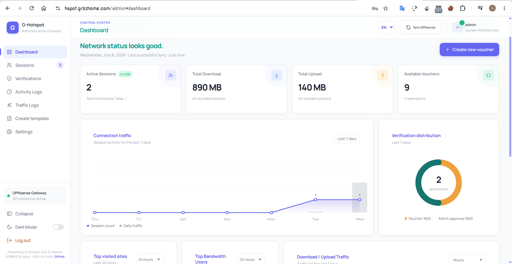

# G-Hotspot

G-Hotspot is a lightweight Node.js captive portal companion for OPNsense. It provides voucher, e-mail OTP, WhatsApp OTP, SMS OTP, Telegram OTP, T.C. identity verification and admin approval flows, then opens the verified client session through the OPNsense Captive Portal Session API.

Türkçe: G-Hotspot, OPNsense captive portal için hazırlanmış hafif bir Node.js doğrulama servisidir. Voucher, e-posta OTP, WhatsApp OTP, SMS OTP, Telegram OTP, T.C. kimlik doğrulama ve yönetici onayı akışlarını sunar; doğrulanan istemciye OPNsense Captive Portal Session API üzerinden internet erişimi açar.

---

## Screenshots

### Portal / Login Page



### Admin Dashboard



---

## Documentation

* [English detailed documentation](docs/README.en.md)
* [Türkçe ayrıntılı dokümantasyon](docs/README.tr.md)
* [Docs index](docs/README.md)

## Current Status

* Version: `1.1.0`
* Runtime: Node.js `>=24.0.0`
* Database: built-in `node:sqlite`
* License: G-Hotspot Noncommercial Source-Available License 1.0
* Default gateway mode: `mock`
* Production gateway mode: `opnsense-api`

## Important Validation Note

5651/syslog logging and the KamuSM RFC3161 timestamp flow have been live-tested with a real KamuSM account. Generic RFC3161 and API-key TSA providers commonly used for US/EU deployments, T.C. identity verification through NVİ KPSv2 and WhatsApp Cloud API delivery are implemented and covered by local tests/mocks where applicable, but they have not been live-tested against real external production services in this repository state.

Validate these flows in your own OPNsense, Kea DHCP, KamuSM or selected TSA provider, NVİ and Meta environments before using them for production or legal evidence processes. Before relying on the 5651/syslog output, generate a sample evidence package (`.log`, `.log.tsq`, `.log.tsr`) and have it reviewed by the legal, privacy, security and evidence-retention teams or advisors responsible for your jurisdiction and organization.

## Önemli Doğrulama Notu

5651/syslog loglama ve KamuSM RFC3161 zaman damgası akışı gerçek KamuSM hesabıyla canlı test edilmiştir. ABD/AB dağıtımlarında yaygın kullanılan genel RFC3161 ve API-key TSA sağlayıcıları, NVİ KPSv2 ile T.C. kimlik doğrulaması ve WhatsApp Cloud API gönderimi kod seviyesinde uygulanmıştır ve uygun yerlerde yerel test/mock kapsamı vardır; ancak bu repo durumunda gerçek dış üretim servisleriyle canlı test edilmemiştir.

Üretim veya hukuki delil süreçlerinden önce kendi OPNsense, Kea DHCP, KamuSM veya seçtiğiniz TSA sağlayıcı, NVİ ve Meta ortamınızda doğrulama yapın. 5651/syslog çıktısına güvenmeden önce örnek bir delil paketi (`.log`, `.log.tsq`, `.log.tsr`) üretin ve bulunduğunuz ülke ile kurumunuzdan sorumlu hukuk, KVKK/gizlilik, bilgi güvenliği ve delil saklama ekiplerine veya danışmanlarına inceletin.

## Feature Summary

* Voucher access with one-time or multi-use codes.
* E-mail OTP with SMTP.
* WhatsApp OTP through Meta WhatsApp Cloud API authentication templates.
* SMS OTP through Netgsm, İleti Merkezi, Twilio or a custom HTTP provider.
* Telegram OTP using a Telegram bot contact-share flow.
* T.C. identity verification through NVİ KPSv2, optionally followed by SMS OTP.
* Admin approval workflow for guest access requests.
* Turkish and English portal/admin UI.
* Admin dashboard, voucher management, session list, CSV exports and activity logs.
* OPNsense Captive Portal Session API integration.
* OPNsense Kea DHCP lease/reservation synchronization.
* OPNsense Traffic Shaper based per-user speed limits and quota profiles.
* 5651/syslog-oriented tamper-evident logging with hash chain and optional KamuSM RFC3161 daily timestamp files.
* System notifications by e-mail, SMS and Telegram.

## Quick Start / Hızlı Kurulum

Clone the repository and start G-Hotspot:

```bash
git clone https://github.com/G-grbz/G-Hotspot.git
cd G-Hotspot
npm start
```

Portal:

```text
http://localhost:8080
```

Admin panel:

```text
http://SERVER_IP:8080/admin
```

Run checks:

```bash
npm test
npm run check
curl http://SERVER_IP:8080/health
```

### English

The first `npm start` prepares `data/system.db`. Open
`http://127.0.0.1:8080/install` locally, or use the remote setup URL printed in
the server console. Remote installation APIs require a setup token; an
ephemeral token is generated at startup unless `SETUP_TOKEN` is supplied.

Admin passwords are stored as scrypt hashes. Configured provider/application
secrets are encrypted in `system.db` with AES-256-GCM. By default the encryption
key is generated as `data/.system-key` with private file permissions; production
deployments can keep the key outside the data directory with
`SYSTEM_ENCRYPTION_KEY` or `SYSTEM_ENCRYPTION_KEY_FILE`.

Existing `.env` files are imported into `system.db` for backward compatibility.
Legacy plaintext admin passwords and database secrets are migrated automatically.
After import, runtime configuration is read from `system.db`; `.env` is not
loaded as a live settings source. Remove or strictly protect the legacy `.env`
after verifying the migration because it can still contain plaintext secrets.

For production setup, OPNsense API permissions, Kea DHCP, 5651/syslog, NVİ and
WhatsApp configuration, read the [English documentation](docs/README.en.md).

### Türkçe

İlk `npm start` çalıştırması `data/system.db` dosyasını hazırlar. Yerel kurulum
için `http://127.0.0.1:8080/install` adresini açın; uzaktan kurulumda sunucu
konsolunda yazdırılan setup URL'sini kullanın. Uzak kurulum API'leri setup token
ister; `SETUP_TOKEN` verilmezse her başlangıçta geçici bir token üretilir.

Admin parolaları scrypt hash olarak saklanır. Uygulama/provider secret değerleri
`system.db` içinde AES-256-GCM ile şifrelenir. Varsayılan encryption key özel
dosya izinleriyle `data/.system-key` olarak üretilir; üretimde anahtarı data
dizininin dışında tutmak için `SYSTEM_ENCRYPTION_KEY` veya
`SYSTEM_ENCRYPTION_KEY_FILE` kullanılabilir.

Mevcut `.env` dosyaları geriye uyumluluk için ilk açılışta `system.db` içine
aktarılır. Eski plaintext admin parolası ve DB secret değerleri otomatik migrate
edilir. Importtan sonra çalışma zamanı ayarları `system.db` üzerinden okunur;
`.env` canlı ayar kaynağı olarak yüklenmez. Migration doğrulandıktan sonra eski
`.env` dosyasını silin veya çok sıkı koruyun; dosyanın kendisi plaintext secret
içerebilir.

Ayrıntılı üretim kurulumu, OPNsense API izinleri, Kea DHCP, 5651/syslog, NVİ ve
WhatsApp ayarları için [Türkçe dokümantasyona](docs/README.tr.md) bakın.

## Production Notes

* Keep `data/system.db` private. Admin passwords are scrypt-hashed and configured secrets are AES-256-GCM encrypted, but the database still contains operational and personal data.
* Keep the encryption key private and backed up. For stronger separation, provide `SYSTEM_ENCRYPTION_KEY` from outside the data directory; losing the key makes encrypted settings unrecoverable.
* Remote `/api/install/*` setup operations require localhost access or the setup token. Prefer `SETUP_TOKEN` supplied by the service environment for managed deployments.
* Use `GATEWAY_MODE=mock` only for development. It does not open real internet access.
* Use `GATEWAY_MODE=opnsense-api` with an OPNsense API user that has only the required effective privileges.
* Kea DHCP is required for the managed DHCP lease/reservation synchronization feature. Disable `OPNSENSE_KEA_LEASE_SYNC_ENABLED` if your OPNsense DHCP setup is not Kea-compatible.
* Put the portal and provider webhooks behind HTTPS in production.
* Do not treat the 5651/syslog feature as a legal compliance guarantee without live testing and legal/process review.

## License and Attribution

G-Hotspot is licensed under the G-Hotspot Noncommercial Source-Available License 1.0. Keep the `LICENSE` and `NOTICE` files with all copies and
modified versions.

Original project attribution: Gökhan GÜRBÜZ, GitHub username `G-grbz`,
https://github.com/G-grbz.

The portal, administration panel and `/api/v1/about` endpoint expose the project
attribution for operators and users.
